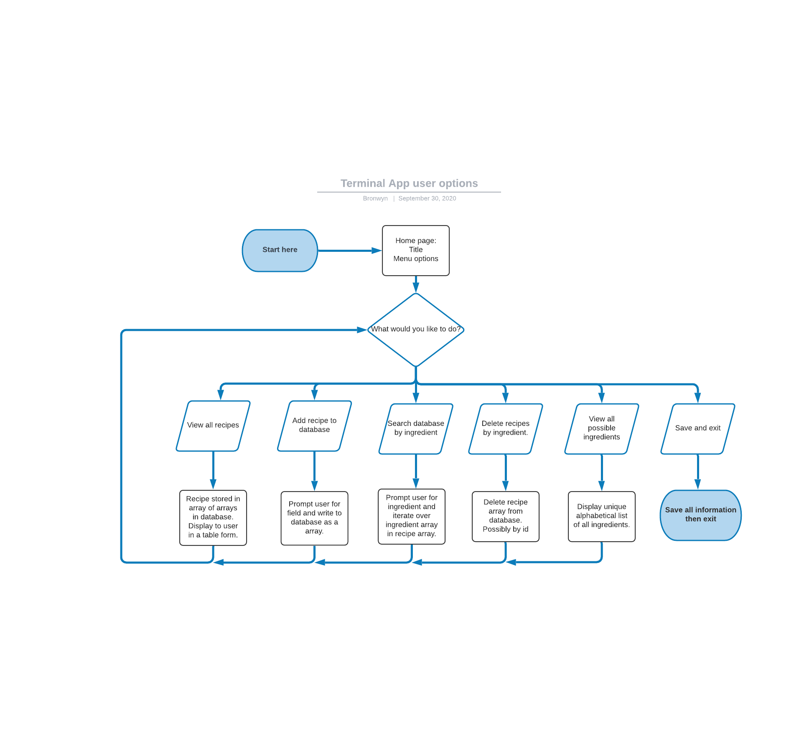

# :recycle: WASTE-ME-NOT :recycle:

## Terminal App Software Development Plan

### :octocat: GitHub (R4)

<https://github.com/bronwyncarr/terminal_app>

### :clipboard: Purpose and scope of the terminal app (R5)

Food waste is a huge environmental and economical problem in Australia, and across the globe.

#### :wastebasket: The extent of food waste

National level:

- 7.5 million tonnes of food is wasted a year
- 3.2 million tonnes of that waste goes to landfill

Household level:

- 1 in 5 food items bought is wasted
- Each week approx. 5kg of food waste goes to landfill
- 50% garbage produced from households is food waste

#### :dollar: The cost of food waste

Environmental cost:

- Food in landfill rots anaerobically producing methane
- Uses resources (water, energy, fossil fuels) to produce and transport food

Economical cost per annum:

- $3,800 per household
- $20 billion nationally
- $990 billion globally

Social injustice:

- 5 millions Australians experienced food insecurity last year
- Globally ¼ of food waste is enough to feed everyone who is undernourished (~ 900million people).

#### :bulb: How the app could help

The app is designed to provide inspiration and ideas to people on how they can use the food they already have in their fridge/pantry rather than throwing it out. It holds a database of recipes and allows people to search the recipe databased for on one or multiple ingredients that they want to “use up”. Users can add and delete recipes from the database.

#### :people_holding_hands: Target audient and how they can use it

The app is designed for people with:

- food they want to use up and staple ingredients such as oil, salt
- the ability to follow a recipe
- basic cooking equipment
- basic IT skills and infrastructure including terminal, keyboard, mouse

The app is designed to provide inspiration on recipes the user can make to use up food rather than wasting it. It provides a recipe name, description and ingredients but does not currently include the full recipe. It is assumed the user can then perform an internet search for the recipe they want or know how to make the recipe. A future feature would be to include a link to a website or even the full recipe in the database.

### :sparkles: Features (R6)

#### All features

The app has the following features:

- menu that displays options to user
- view all recipes in the database
- create a new recipe
- delete an existing recipe
- search all recipes by ingredient
- view all ingredients

#### :pencil: Three features in detail

##### Menu

This feature displays a welcome header to the user and a menu of options they can choose from.

The header is centred, colored with the colorize gem and uses TTY Box gem to draw a line above and below the header that spans the full width of the screen. The header is responsive by using the TTY screen gem to get the screen width.

The menu uses the TTY Prompt gem to display the options which cycles at the end. The user navigate by using the up and down key, then press enter to select. The *active* option is coloured cyan using colorize gem to draw attention to it.

##### View all recipes

This feature displays a responsive header *"Your recipe database so far"*.

It uses control flow to check if the recipe_list array variable that was instantiated when the Menu class is created is empty and if so displays a prompt the the user that there are no recipes. If the array is not empty this information is displayed to the user using TTY Table gem. The table takes the TABLE_HEADING constant for the table headings which are displayed in blue using the colorize gem and centred.

##### Create new recipe

This feature displays a responsive header *"Create a new recipe"*.

It prompts the user to enter the recipe name, a description and the ingredients separated by a space. These are required fields so error handling will prompt the user and ask them to try again if they are empty. The inputs are cleaned for consistency  with *.strip* *.capitalize* or *.downcase* and the ingredients are converted to an array with *.split*.

These variables are then added to an array which is passed as argument to the create_recipe method in the Library class, which adds them to the recipes array. This is then written to the database and the user is directed back to the menu.

With adding and deleting a recipe function I considered having the data persist in memory until the user exits the app and then having it written to the database but decided to do it each time so it could be scaled with multiple users using it simultaneously.

### :information_source: User Interaction (R7)

#### Overview

The following flowchart shows the basic user options within the app.



#### Information on how to interact with the app

The user can learn about the app by typing *' -h'* or *'--help'* after the name of the app, e.g.

```bash
terminal -h
```

This displays a table which outlines the available shortcuts that can be used. There is shortcuts to go directly to:

- a list of recipes displayed in a table
- the search by ingredient function

#### Managing user interaction

When the user loads the app for the first time a heading is displayed with a menu below. The menu shows the user all the features of the app. This information is displayed with the TTY prompt gem as a rotating selectable list of six options. This was selected so it was visually straightforward for the user. No user input is required apart from clicking enter so there is no raw input to validate or error handle.

After each feature is complete the *home* menu displays below bringing the user back to the entry point and core of the app. This was designed for familiarity, orientation and to make navigation easy.

#### Managing user input

Where possible TTY prompt has been used to gather user including:

- selecting the ingredient from a list to search for
- when multiple ingredients listed selecting to search for recipes containing ALL or ANY of the ingredients
- when asking the user to confirm if they want to delete a recipe

In other places, users are required to type in input including:

- when the user enters a new recipe
- when the user deletes a recipe

To assist getting accurate typed in user input, error handling is used if no value is entered. In this case, the user if notified that no value was entered and prompted to try again. On test input values .capitalize or .downcase is used for consistency. When deleting an item, the table list of ingredients is first displayed to user. By getting the user to type in the name it helps prevent accidental deleting by inadvertent clicking.

### :play_or_pause_button: Control Flow (R8)

Basic user options  show the user interaction based on user input.


### :calendar: Implementation Plan (R9)

This project has a number of requirements and specifications to keep track of. I used a Trello board for organisation, prioritising  tasks and setting deadlines. I referred to this frequently whilst working on the assignment to keep myself orientated and on track.

[Current Trello board can be viewed here](https://trello.com/b/uapHR845/terminal-app)

Trello board on the 23-SEPT towards the start of the project:


Trello board on the 27-SEPT midway through the project:


Trello board on the 02-OCT towards the end of the project:

XXXXXXXXXXXXXXXXXXXXXXXXXX
TRELLO
XXXXXXXXXXXXXXXXXXXXXXXX

### :books: Installation and Setup (R10)

1. Install ruby, we recommend using [asdf](https://asdf-vm.com/)

1. Install git, go to the [official docs](https://git-scm.com/downloads) for more information.

1. `git clone` the app to your home directory

```bash
git clone https://github.com/bronwyncarr/terminal_app ~/terminal-app
```

1. Run the setup executable file

```bash
~/terminal-app/bin/setup
```

1. Open your .bash_profile in a text editor

1. Add this line

```bash
export PATH=$PATH:$HOME/terminal-app/bin
```

1. Restart your terminal to make sure .bash_profile loads the app into your PATH

1. Run the bookmarks executable to start the app

```bash
terminal
```

#### :rotating_light: Tests

Here is a link to my testing spreadsheet.

If you use RSpec you can say...

To run tests run:

rspec spec

#### :scroll: References (R3)

<https://www.ozharvest.org/what-we-do/environment-facts/>

<https://www.foodbank.org.au/>
